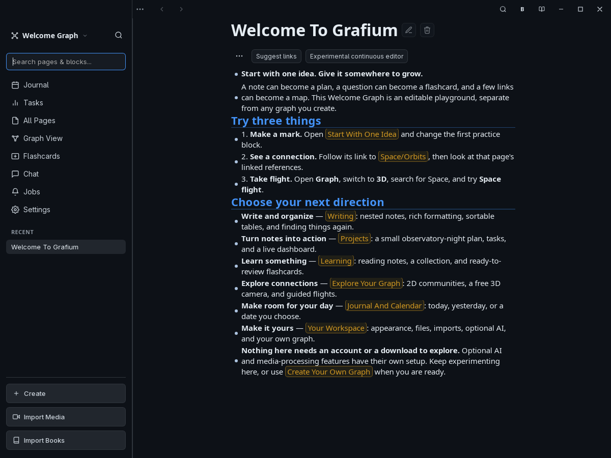
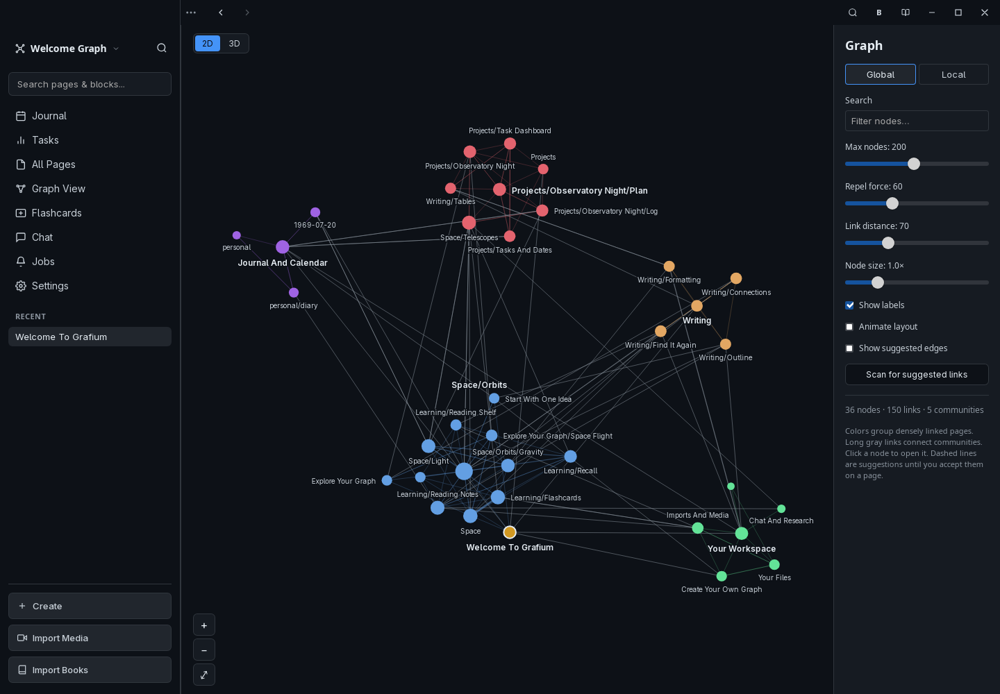
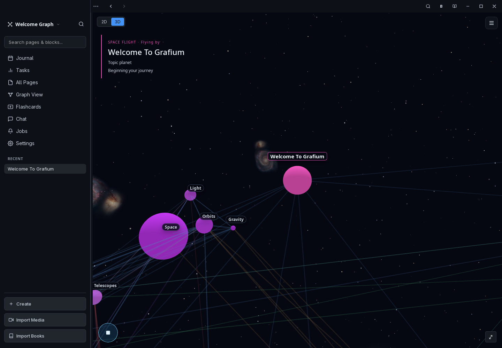

<div align="center">


# Grafium

**Write like an editor. Think like an outliner.**

A local-first notebook for ideas that deserve more than a place to sit.
Write, connect, plan, study, and explore your knowledge without giving up your files.

[Download](https://github.com/KonTy/grafium/releases/latest) ·
[Get started](#start-with-one-idea) ·
[Feature reference](#feature-reference) ·
[Build from source](#build-from-source)

</div>



*The screenshots in this README use only the included Welcome graph, never personal notes.*

## Start with one idea

Capture a thought in today's journal. Turn a phrase into a `[[page link]]`.
Make the next step a `TODO`, or a useful fact a `Question :: Answer` flashcard.
The same writing becomes something you can find, follow, act on, and remember.

Grafium keeps each block an **addressable piece of knowledge**. Nest an outline,
select groups of blocks, and edit Markdown in place: click into a block to work
with its source, then move away to read the rendered result. For continuous
cross-block text selection, try the per-page **Experimental continuous editor**;
the classic editor remains available. Both preserve individual block identities
in SQLite. A page is not flattened into one giant database record.

1. **Open Grafium.** A self-contained Welcome graph gives you real notes, links,
   tasks, tables, queries, and flashcards to explore. No AI setup is needed for the tour.
2. **Try something small.** Edit a sample block, follow a link, sort a table,
   or open the graph and take a flight.
3. **Make your own space.** Choose **New Graph** from the graph menu and select a
   folder. You can switch between graphs; the Welcome graph stays separate.

## See the connections, not just the dots

The **2D graph** makes densely connected groups easier to read, with well-connected
pages at their centers and longer bridges between communities. Search for a page,
inspect its neighborhood, or zoom out to the wider graph.



The **3D graph** shows the same pages and accepted connections in depth. Solid
spheres, a field of varied stars, and distant galaxy images give your knowledge a
different sense of scale. Unlinked pages sit on an imaginary sphere rather than a
flat ring. Dates and journal connections remain visible by default.

**Space flight** is a guided flyover through the visible graph: follow links,
approach a named topic, orbit it, and continue. Namespace children become
satellites around their parent topics. Search first to choose a starting point;
**Stop flight** or **Escape** returns you to the original layout.



These are views of your knowledge, not changes to it. Decorative stars, galaxies,
planet rings, satellites, and flight-only hierarchy routes do not create notes or
rewrite saved links.

<details>
<summary>How the graph layout works</summary>

Both views share deterministic, weighted
[Louvain-style community detection](https://arxiv.org/abs/0803.0476), followed by a
custom community-level layout, hub-centered placement, and anchored refinement.
The separation of tight groups and longer bridges follows graph-readability
principles discussed in [ForceAtlas2](https://doi.org/10.1371/journal.pone.0098679);
Grafium does not implement the full ForceAtlas2 or Leiden algorithms.

Community colors represent link structure in the loaded graph, not AI-assigned
subjects. The result can change with local/global scope or the node limit.
Suggested links are separate from structural clustering and spring attraction.
The 2D view manages label collisions and prioritizes hubs; both views preserve
manual navigation and dragging.

Stars vary in size and brightness. Galaxy images are bundled for offline use and
credited in [the space asset attribution](ui/public/space/ATTRIBUTION.txt).
The backdrop appears in normal 3D viewing and flight, with a quieter treatment
behind the normal graph. It is decorative, not an astronomical map.

</details>

## Feature reference

### Writing and reading

| Feature | What you can do |
| --- | --- |
| Block selection | Shift+Up/Down selects text first, then whole blocks at the edge, including across journal days. Reverse direction to shrink the selection; copy, cut, delete, and undo work on the group without merging its stored blocks. Deleting keeps the caret at the gap: start of the next block, end of the previous block if no next block remains, or an editable blank on an emptied page. |
| Experimental continuous editor | Opt into a one-surface editor for cross-block text selection on an individual page or journal day; switch back to the classic editor at any time. |
| In-place Markdown | Edit a focused block as source and read it as rendered Markdown when you leave it. |
| Nested outlines | Indent, outdent, reorder, fold, and expand blocks and their children. |
| Bullet threading | Follow the active outline branch with connected guides and elbows. |
| Editing tools | Split and merge blocks, insert a newline within a block, undo/redo edits, and copy or paste outlines. |
| Formatting | Headings, emphasis, strikethrough, quotes, lists, inline code, and fenced code blocks. |
| Math | Write inline and display mathematics with KaTeX. |
| Sortable Markdown tables | Click a rendered column heading to sort ascending or descending, with numeric-aware ordering. The new order is saved back to Markdown. |
| Rich paste | Convert pasted HTML to Markdown and preserve supported structure and media. |
| Images, audio, and video | Keep graph assets alongside notes and render supported media inline, including on flashcards. |
| Commands and templates | Use the editor's command menus rather than memorizing every Markdown pattern. |
| Emoji and icon picker | Type `/emoji` for emoji, `/icon` for built-in symbolic icons, or `/em` for both; add search words and choose from the completions in either editor. |
| Portable icons | Emoji are stored as literal characters. Icon shortcodes such as `:icon-star:` remain readable in source and render as icons outside code. |
| Bionic Speedreader | Toggle the top-bar **B** button to emphasize word beginnings in rendered notes. It changes presentation, not the Markdown, and leaves code and math alone. |
| Callouts | Insert styled notes, warnings, tips, and other supported callout templates. |
| Selection actions | Turn selected bullets into TODOs or tasks back into bullets, and make links from selected text. |
| Reading notes | Open the right panel's **Notes** tab, select a passage and choose **Use selection**, then write and **Save note**. Notes can also apply to the whole current page, book, or journal day. No AI is required. |
| Self-contained annotations | New notes are Markdown footnotes inside the source file, with hidden quote-anchor metadata. Copying the book's `.md` carries its annotations too; SQLite is only a rebuildable index. Click a footnote marker to open its note in the pane. Ambiguous or missing passages remain flagged instead of being guessed. |

Reading-note drafts survive navigation during the app session, but **Save note**
is required before closing the app. Saving adds reference markers and footnote
definitions without rewriting the book's words. Conflicting external edits leave
your draft intact. Earlier standalone Markdown note files remain supported and
are not automatically moved or deleted. Your annotations are kept separate from
the book evidence used by AI research. A misplaced inline note can be reattached
within its source file; moving it to a different file is not yet supported.
For passage selection, use the classic editor when an imported file has no saved
block IDs; the experimental continuous editor reports this rather than guessing.

### Journals, calendars, and tasks

| Feature | What you can do |
| --- | --- |
| Daily journals | Start with today's page and scroll through older entries in one journal view. Arrow Down/Up continues into the adjacent day when the caret reaches the last/first line. |
| **Go to date calendar** | Open with **Ctrl/Cmd+G**, navigate with the keyboard, and jump to a past or future journal. Circled days contain notes; the selected day's page is opened or created for you. |
| Fast month/year navigation | Click the calendar's month or year heading to choose directly, page through years, or return with **Today**. |
| Journal shortcuts | Move to today's, tomorrow's, previous, or next journal without hunting through the page tree. |
| Task blocks | Keep `TODO`, `DOING`, `DONE`, and `CANCELED` items inside the notes that give them context. |
| Task dates | Set **SCHEDULED** and **DEADLINE** dates with a calendar picker. |
| Priorities and recurrence | Read task priorities and Org-style timestamp repeaters such as `.+1d`, `++1w`, and `+1m`; completing a repeating task advances its next occurrence. |
| Task-format compatibility | Read Logseq/Org tasks, Markdown checkboxes, and supported Obsidian Tasks date/priority metadata; write a consistent task representation. |
| Tasks workspace | Group and sort open work by date, page, or priority and jump back to its source note. |
| Completion history | Record completion timestamps in Markdown and browse completed tasks by day. |
| Activity and flow | Explore task-completion and note-edit heatmaps, completion pace, cycle/lead time, and on-time completion metrics. |
| Live task views | Gather work from across the graph into query-driven lists and dashboards. |
| Progressive journal loading | Older editors load near the viewport and stay mounted once opened, preserving ongoing edits and selection. |

### Connecting and finding

| Feature | What you can do |
| --- | --- |
| Page links | Connect ideas with `[[page names]]` and autocomplete existing titles. |
| Block references | Refer to an individual block with `((block-id))`, not just its containing page. |
| Tags | Add `#tags` and hierarchical tags to make ideas easier to gather. |
| Backlinks | See the notes that refer to the current page, with block-level context. |
| Reviewable link suggestions | Scan exact mentions or ask AI to find concept edges; **Link**, **Link all**, **Fix + link**, or dismiss with **Not an edge**, with undo available. |
| Consistent concept links | Generated summaries and accepted suggestions display concepts as `#multi_word_name`, stored as `[[Canonical page title|#multi_word_name]]`. The label does not rename the destination. Existing titles and approved aliases are reused; ambiguous candidates require a choice. Discovering or dismissing suggestions does not create pages. |
| Namespaces | Organize slash-separated titles such as `Projects/Observatory/Checklist` into a navigable tree. |
| Collections | Mark a page as a book or paper collection from its page menu; navigate its ordered linked members, or convert it back to a regular page. |
| All Pages | Browse the namespace hierarchy and find pages without remembering their exact location. |
| Favorites and recent pages | Keep frequently used material close at hand and return to recent work. |
| Full-text search | Search indexed note content with SQLite FTS5 and ranked results. |
| Go to link | Press **Ctrl/Cmd+L**, or use the link icon beside the journal calendar, to browse all pages with an immediately focused fuzzy search. Arrows browse; Enter opens; Escape cancels. |
| Global search | Search pages and note content with **Ctrl/Cmd+K**, independently of the right panel. Exact search works without AI; semantic search uses the configured embedding index. |
| In-page search and history | Find text in the current page and move backward or forward through navigation history. |
| 2D and 3D graphs | Explore global or local connections, search, pan, zoom, inspect, and drag nodes. |
| Community layouts | Distinguish dense groups from the bridges between them, using shared clustering in both views. |
| 3D flyovers | Take a **Space flight** through topics, or use manual camera navigation. |

### Learning and working with sources

| Feature | What you can do |
| --- | --- |
| Flashcards in your notes | Write `Question :: Answer` to make a reviewable card without maintaining a second copy. |
| Spaced repetition | Reveal answers and grade recall with **Again**, **Hard**, **Good**, or **Easy**; SM-2 schedules subsequent reviews. |
| Study topics | Use tags to study one topic or mix cards from across your notes. |
| Rich flashcards | Include Markdown, mathematics, images, audio, and video in cards. |
| Anki import | Bring `.apkg` decks and supported media into Grafium's note-and-card workflow. |
| Book imports | Import folders containing EPUB, PDF, HTML, Markdown, text, and FB2 books into editable book pages. |
| Reading structure | Keep paragraphs nested under detected chapter and section headings, with referenced media where extraction is supported. |
| Scanned PDF OCR | Extract text locally with Poppler and Tesseract; optional ImageMagick helps extract figure regions. |
| Audio/video processing | Turn supported media sources into notes with transcripts; local transcription needs its model and supporting tools. |
| Background jobs | Follow longer-running imports and processing, cancel supported running jobs, and clear finished entries without blocking the editor. |

### Live queries

Ask questions of the actual SQLite index from inside a note. `{{query ...}}`
blocks render results inline as tables, so a dashboard can live beside the work
it describes. Queries are read-only; query blocks exclude themselves and other
query blocks from content results. Use SQL `ORDER BY` for query-table sorting;
click-to-sort applies to ordinary Markdown tables.

**Open tasks, with their source pages:**

```text
{{query SELECT p.title AS page, b.content AS task FROM tasks t JOIN blocks b ON b.id = t.block_id JOIN pages p ON p.id = b.page_id WHERE t.state IN ('TODO', 'DOING') ORDER BY p.title, b.order_index}}
```

**Recently changed pages:**

```text
{{query SELECT title, datetime(updated_at, 'unixepoch') AS modified FROM pages WHERE is_journal = 0 ORDER BY updated_at DESC LIMIT 10}}
```

**Upcoming scheduled work:**

```text
{{query SELECT p.title AS page, b.content AS task, t.scheduled_date AS scheduled FROM tasks t JOIN blocks b ON b.id = t.block_id JOIN pages p ON p.id = b.page_id WHERE t.state IN ('TODO', 'DOING') AND t.scheduled_date BETWEEN date('now') AND date('now', '+7 days') ORDER BY t.scheduled_date}}
```

The Welcome graph includes working examples against its own sample notes.

### Optional AI and research

AI is an addition to the notebook, not a requirement for writing, linking,
searching, querying, graph exploration, or flashcard review.

| Feature | What you can do |
| --- | --- |
| One Chat, two placements | Use the same conversation interface in the main Chat view or beside your notes. The right panel has **Chat** and **Notes** tabs. Expanding a conversation keeps its identity, messages, draft, and active request rather than starting another chat. |
| Explicit context | Sidebar Chat starts with the current page, recognized book, or focused journal day. Choose a selected passage, a block and its children, an available heading-defined section, the whole book, or **My graph**. Main Chat starts with **No notes**, which skips note retrieval and excludes earlier note-backed turns from the model's conversation history. |
| Answer -- no web | Answer from the selected context and the configured model's knowledge without searching the internet. This is the default; asking to "verify" or "research" something does not silently enable browsing. |
| Web search | Grafium searches the web and supplies retrieved evidence to the configured model for an answer. Context and web permission are separate choices. |
| Deep web research | Grafium plans searches, reads sources, assesses gaps, refines queries, and synthesizes a cited answer over multiple rounds. This is an explicit mode, not a second checkbox or a promise to read an entire book. |
| Research controls | Configure search engines, source/round limits, and workflow prompts. |
| Source-specific conversations | Each source has its own thread and draft. Answers continue while the panel is hidden or another page is open. Requests retain their initiating context and mode. Returning restores that source's conversation; **New conversation** clears it and restores the default context and no-web mode. Switching graphs stops active requests. |
| Several conversations at once | Chat keeps a list of conversations rather than one box, with a switcher to move between them. Each is named from its opening question and then renamed by the model once there is an answer to summarize; a name you type yourself is never overwritten. Right-click to rename or delete. |
| Conversations are stored, and stay on this machine | The 50 most recent conversations are saved in the graph's `.grafium` folder and reloaded on restart. Sync never collects them, so they do not travel to a phone, a USB stick, or a file server -- a conversation can quote notes the other end has no business receiving. |
| Conversation memory is recency-based | A conversation that still fits is sent in full. Once it does not, the last four turns are kept and everything older is cut to its first 220 characters and gathered into a recap, capped at about 4,000 characters and shrunk further when the prompt still does not fit. The recap is truncation, not a model-written summary, and old turns are not searchable by meaning -- unlike notes, there is no semantic recall over conversation history. The full transcript stays readable on screen; the limit is on what the model is sent. |
| Long-source research | Retrieve bounded excerpts instead of putting an entire book into the question. Prompt fitting accounts for history, model tokens, and answer space while preserving citation labels. Answers disclose partial coverage; targeted questions are supported, not a guaranteed exhaustive review of every chapter. |
| Provider choice | Configure local models, a self-hosted endpoint, or a supported cloud provider. The model connection is shown separately from context and web mode. |
| Model settings | Manage generation and embedding configuration separately; local models require suitable weights and hardware. |
| Embedded or server-based models | On desktop, use embedded llama.cpp with local GGUF files, Ollama, or an OpenAI-compatible endpoint; cloud options include OpenAI and Anthropic. |
| Page and selection analysis | Run knowledge analysis for the current page or selected blocks instead of processing everything. |
| Explicit writing tools | Summarize, find links, and open writing assistance from Chat's tools rather than separate competing conversation tabs. Asking a question never silently rewrites your notes; insertions and rewrites require their explicit actions. |
| Safe summary insertion | Generated summaries remain associated with their source page. **Insert into page** adds a linked block tree after the captured reading position, leaves original text unchanged, and records one undo action. It reuses existing concept pages, creates new concepts only on insertion, and reports ambiguous concepts left unlinked. Code, math, URLs, and existing links are protected. |
| Ask about long videos and notes | Block context searches the block and its children; page context searches only the selected page or journal day. Chat selects bounded, relevant excerpts from current text rather than pasting the whole transcript into the question. Keyword retrieval works immediately without an embedding index; available, current vector matches improve ranking. Full prompts, history, and answer reserves are fitted to the model context, using the native tokenizer for embedded models. Long sources may be only partially covered. |
| AI writing assessment | Open **Writing assistance** from Chat's tools or the command palette. **Analyze AI style** uses your connected model to explain formulaic writing patterns, with a subjective 0-100 style score or an inconclusive result and explicit coverage. This is not a validated authorship detector or a probability that AI wrote the text. |
| Natural rewriting | **Rewrite naturally** makes small wording edits in the selected block or page, including scientific and technical text. Grafium retains protected numbers, citations, and formatting instead of asking the model to reproduce them; this limits sentence rearrangement. Invalid proposals leave the affected wording unchanged and are reported by block and line; validated edits apply together. Block identities and unsupported blocks stay unchanged. Review meaning and scientific details before keeping changes. In journals, Page scope uses only the selected day. Rewrites are guarded against concurrent edits and recorded as one Ctrl+Z undo action; Ctrl+Y redoes them. No guarantee of lower scores from external detectors. |

**Grafium owns web access, not the model provider.** Web search and Deep web
research run Grafium's search and page-reading tools, then pass evidence through
the configured model's normal API. An OpenAI-compatible DGX Spark or another
self-hosted model server does not need internet access or provider-native
browsing. Grafium itself needs network access for web modes; it does not switch
models to obtain it.

**No web is not a privacy switch for the model connection.** An API-connected
model still receives your question and selected note evidence, even in Answer
mode. A configuration called "cloud" can point to a private server; it does not
mean that server can browse. Web modes send derived queries to external search
engines and contact websites. Model and media downloads also require network
access.

### Your workspace, your files

| Feature | What you can do |
| --- | --- |
| Multiple graphs | Create and switch between separate graph folders. |
| Portable Markdown | Keep page and journal content as ordinary `.md` files, with graph-relative assets. |
| Live file watching | Edit files externally and let Grafium reconcile the changes with its index. |
| Filesystem and WebDAV sync | Configure USB drives, mounted network folders, or a WebDAV server such as Nextcloud; run **Sync Now** from Settings. |
| Target availability | Configured auto-sync targets synchronize when the native monitor detects that they have become available. |
| Sync reporting | See pushed/pulled files, deletions, conflicts, and errors. File sync is not simultaneous collaborative editing; review conflicts and keep backups. |
| Theme choice | Use built-in light, dark, and OLED themes, including GitHub Light and GitHub Dark. |
| Reading width | Adjust narrow-view padding as a percentage on each side; the default is **15% per side**. |
| Wide mode | Switch between full-width and narrow reading layouts; the selected mode is remembered across app launches. |
| Zen mode and panels | Hide distractions or toggle the left and right sidebars independently. The left menu starts open on desktop and remembers your open/closed choice across launches. |
| Findable settings | Filter labels and help text with literal search terms, and open categorized keyboard-shortcut help. |
| Maintenance tools | Manually re-index a graph, inspect asset-cleanup candidates, or preview task-completion backfills before applying them. |
| Responsive workspace | Use the desktop layout or Android's adapted editor controls. |
| Theme-aware startup | Apply the saved theme before showing the desktop window; defer optional screens and local embedding-model loading. |

Your notes are portable, but Markdown is not a complete backup of every piece of
application state. Preserve graph folders, assets, and application data when
backing up or moving installations, including review scheduling and other database
history. Keep credentials and private data out of public repositories.
Sync sends graph files to the destinations you configure; use destinations you trust.

### Useful shortcuts

| Action | Shortcut |
| --- | --- |
| Global search | `Ctrl/Cmd+K` |
| Search within the page | `Ctrl/Cmd+Shift+K` |
| Command palette | `Ctrl/Cmd+Shift+P` |
| Today's journal, ready to edit | `Ctrl/Cmd+Shift+J` |
| Go to date calendar | `Ctrl/Cmd+G` |
| Go to link (fuzzy page picker) | `Ctrl/Cmd+L` |
| Chat | `Alt+C` |
| Left / right sidebar | `Ctrl/Cmd+B` / `Ctrl/Cmd+Shift+B` |
| Bold selection in the block editor | `Ctrl/Cmd+Alt+B` |
| Scroll the main page, book, journal, or task pane (even while editing) | `Page Up` / `Page Down` |
| Graph / Flashcards / Tasks | `Ctrl/Cmd+Shift+G` / `F` / `T` |
| Previous / next journal | `Ctrl/Cmd+Shift+,` / `Ctrl/Cmd+Shift+.` |
| Wide / Zen mode | `Alt+W` / `Alt+Z` |
| Import media / books | `Alt+M` / `Alt+B` |
| Insert current time | `Alt+T` |
| Insert the `[[personal/diary]]` link | `Alt+D` |

Navigation mode also supports sequences such as `g j` (journal), `g g` (graph),
`g f` (flashcards), and `t w` (wide mode). They do not run as navigation commands
while you are typing in the editor.

Page Up/Down do not move the note cursor or require a click in the reading pane.
Modified keys, including Shift+Page Up/Down selection, retain their editor behavior;
menus and dialogs keep their own keyboard navigation. Graph controls are unchanged.

## Download

[Get a release build](https://github.com/KonTy/grafium/releases/latest) or
[browse all releases](https://github.com/KonTy/grafium/releases).

| Platform | Packages |
| --- | --- |
| Linux | AppImage and Debian package (`.deb`) |
| Windows | Installer (`.exe`) and MSI |
| Android | APK; check the release's signing status before installing |

Grafium is in active development. This README describes the current source;
packaged releases may not include the newest additions. Android's embedded desktop
AI/transcription engines are not included in its build. An APK explicitly named
`unsigned` needs signing before it can be installed. macOS packages are not
currently produced by the release workflow.

## Build from source

Use a stable Rust toolchain, Node.js 20 or newer, npm, and the
[Tauri platform prerequisites](https://v2.tauri.app/start/prerequisites/).
Desktop builds also compile the embedded llama.cpp and Whisper engines: install a
C/C++ toolchain, CMake, Clang/libclang, and the Vulkan development tools, including
`glslc`. A working Vulkan driver enables GPU acceleration.

On Ubuntu/Debian, the development packages include:

```bash
sudo apt install build-essential pkg-config cmake clang libclang-dev libssl-dev \
  libwebkit2gtk-4.1-dev libsoup-3.0-dev libgtk-3-dev librsvg2-dev \
  libappindicator3-dev patchelf libvulkan-dev glslc
```

On other Linux distributions, install the equivalent GTK 3, WebKitGTK 4.1,
libsoup 3, librsvg, and Vulkan development packages. Windows builds need the MSVC
C++ build tools, WebView2, and a Vulkan SDK.

Run these commands **from the repository root**:

```bash
# Install the frontend dependencies.
npm --prefix ui ci

# Run the native app in development.
npm --prefix ui run tauri -- dev

# Build the app and platform packages.
npm --prefix ui run tauri -- build

# Or build the native executable without installers.
npm --prefix ui run tauri -- build --no-bundle
```

The native executable is under `target/release/`; installers are under
`target/release/bundle/`. Desktop builds also require their generated native AI
libraries: distribute the package, not just a bare executable copied elsewhere.
Keep `custom-protocol` as a crate feature rather than enabling it directly on the
`tauri` dependency, so development loads Vite and releases embed the built frontend.

<details>
<summary>Optional import tools and other interfaces</summary>

For scanned PDF imports, install Poppler (`pdfinfo`, `pdftoppm`) and Tesseract.
ImageMagick's `magick` command enables additional scanned-figure extraction.
Audio/video processing needs its configured transcription model and supporting
download/conversion tools; those are separate from ordinary note editing.

The repository also contains a source-built terminal interface:

```bash
cargo run -p grafium-tui -- /path/to/your/graph
```

Pass a graph path explicitly: without one, the terminal interface uses the current
directory. It is a separate interface, not a claim of desktop feature parity.

Android builds use Tauri's Android tooling and require the JDK, Android SDK/NDK,
and target Rust toolchains. See the actual build steps in the
[release workflow](.github/workflows/release.yml).
The old standalone `android/` companion is deprecated; it is not the current app.

</details>

### Development checks

```bash
cargo test -p grafium-core
cargo test -p grafium --lib welcome
npm --prefix ui test

# Browser setup, once; then run the integration suite.
cd ui
npx playwright install chromium
npm run test:ui
```

Browser tests start their own dev server and use Tauri IPC fixtures rather than a
personal graph. They exercise interactions that unit tests alone cannot cover,
including startup, journals, selection, tables, and graph rendering.

### Under the hood

| Layer | Technology |
| --- | --- |
| Core | Rust: graph storage, parsing, indexing, tasks, cards, imports, and optional AI |
| Database | SQLite with WAL, FTS5, JSON1, and pooled connections |
| Interface | Svelte 5 and CodeMirror 6 |
| Native shell | Tauri 2 and the platform webview |
| Rendering | Markdown, KaTeX, 2D canvas, and Three.js-powered 3D graphs |
| Local inference | Optional llama.cpp and Whisper integrations |

## Contributing and license

Bug reports, focused improvements, and documentation contributions are welcome.
[Open an issue](https://github.com/KonTy/grafium/issues) with clear reproduction
steps; use a small sample graph instead of sharing personal notes or credentials.

Grafium is [MIT licensed](LICENSE).
Bundled galaxy photography has its own [credits and usage information](ui/public/space/ATTRIBUTION.txt).
